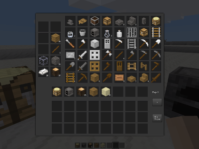

This mod adds a new crafting system, either in parallel to the default grid-based crafting system or as complete replacement to it. The new crafting system doesn't care about the arrangement of raw materials, only the relative proportions of them. Effectively, every recipe is now "shapeless".

By default, this mod has no effect on its own - it's intended as an API that allows it to be used by other mods, for example creating specialized crafting tables with particular lists of recipes available. However, if you set the "simplecrafting_lib_override_default_player_crafting" configuration variable to "true" it will replace the player's inventory crafting interface with one derived from this system.

You can continue to use minetest.register_craft to register crafts as normal, this mod hooks into it and can reinterpret recipes registered via it to use with the new crafting system as well.

Alternately, use the "simplecrafting_lib.register" method to register recipes for the new
system exclusively. Examples are given below:

	simplecrafting_lib.register("table", {
		input = {
			["group:stone"] = 1,
			["bucket:lava_bucket"] = 1,
		},
		output = "default:obsidian 2",
	
		-- Items which the crafting recipe produces, but is not
		-- formally used to make.
		returns = {
			["bucket:bucket"] = 1,
		},
	})
	
	simplecrafting_lib.register("furnace", {
		input = {
			["farming:flour"] = 1,
			["simplecrafting_lib:heat"] = 5,
		},
		output = "farming:bread",
	})
	
	simplecrafting_lib.register("fuel", {
		-- Group names are allowed when defining fuel inputs.
		-- If there is not an item specific recipe then it will take the
		-- definition of its longest burning group
		input = {
			["group:tree"] = 1,
		},
		output = "simplecrafting_lib:heat 40",
	})

As a simple example, the following code will register a filter that imports all "normal" crafting recipes into a craft_type called "table", and removes them from the legacy crafting system in the process, but leaves "cooking" and "fuel" recipes alone:

	simplecrafting_lib.register_recipe_import_filter(function(legacy_recipe)
		if legacy_recipe.input["simplecrafting_lib:heat"] then
			return nil, false
		elseif legacy_recipe.output and legacy_recipe.output:get_name() == "simplecrafting_lib:heat" then
			return nil, false
		else
			return "table", true
		end
	end)

Note that clearing large numbers of recipes from the native crafting system can take a long time on startup, see [issue #5790 on Minetest](https://github.com/minetest/minetest/issues/5790).

To create a standard crafting table that would be able to make use of the "table" craft_type populated by the above recipe import filter, there's a convenience function that provides pre-generated functions for use with a crafting table node definition. The following code shows an example:

	local table_functions = simplecrafting_lib.generate_table_functions("table", show_guides, alphabetize_items)

	local table_def = {
		description = S("Crafting Table"),
		drawtype = "normal",
		tiles = {"crafting.table_top.png", "default_chest_top.png",
			"crafting.table_front.png", "crafting.table_front.png",
			"crafting.table_side.png", "crafting.table_side.png"},
		sounds = default.node_sound_wood_defaults(),
		paramtype2 = "facedir",
		is_ground_content = false,
		groups = {oddly_breakable_by_hand = 1, choppy=3},
	}
	for k, v in pairs(table_functions) do
		table_def[k] = v
	end

	minetest.register_node("crafting:table", table_def)
	
This produces a crafting table with a formspec similar to the following:

[See api.md for more information about how to use this mod's API.](api.md)

This library is released under the MIT license.