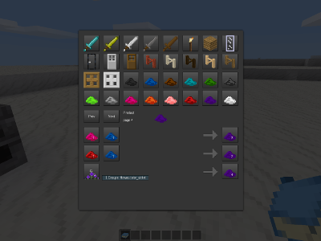
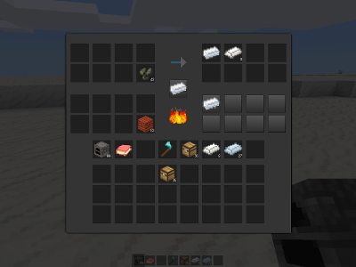
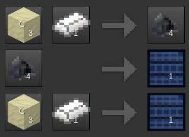

# Common parameter types

Parameter types common to various simplecrafting_lib functions have the following names:

* `craft_type` - a string identifying a group of crafting recipes
* `item_name` - a string identifying a particular type of item, eg **"default:stone"**
* `item_list` - the product of an `InvRef:get_list(listname)` call
* `count_list` - a list of items and quantities in the form as used in this mod's recipe definitions
* `listname` - a string identifying a list within an inventory

# Recipe Registration

## `simplecrafting_lib.register(craft_type, def)`

A crafting system first needs recipes for things to craft. Simplecrafting_lib allows recipes to be added to its library directly using this method.

example parameters:

	simplecrafting_lib.register("table", {
		input = {
			["group:stone"] = 1,
			["bucket:lava_bucket"] = 1,
		},
		output = {
			["default:obsidian"] = 2,
		},
	
		-- Items which the crafting recipe produces, but is not
		-- formally used to make.
		returns = {
			["bucket:bucket"] = 1,
		},
	})
	
	simplecrafting_lib.register("furnace", {
		input = {
			["farming:flour"] = 1,
		},
		output = {
			["farming:bread"] = 1,
		},
		cooktime = 5.0,
	})
	
	simplecrafting_lib.register("fuel", {
		-- Group names are allowed when defining fuel inputs.
		-- If there is not an item specific recipe then it will take the
		-- definition of its longest burning group
		input = {
			["group:tree"] = 1,
		},
		output = {
		},
		burntime = 40.0,
	})

The recipe def can have any other properties the user wishes to add, these examples only show the ones that are used by the crafting methods in this mod.

## `simplecrafting_lib.register_reversible(craft_type, forward_def)`

A convenience method that registers the provided crafting recipe and also automatically creates and registers a "reverse" craft of the same type.

This should generally only be done with craft that turns one type of item into one other type of item (for example, metal ingots <-> metal blocks), but it will still work if there are multiple inputs.

If there's more than one input type it will use "returns" to give them to the player in the reverse craft, using the input with the highest count as the primary output.

Don't use a recipe that has a **"group:"** input with this, because obviously that can't be turned into an output. The mod will assert if you try to do this.

# Legacy Recipe Import

These two methods will allow recipes to be imported into simplecrafting_lib from mods using the old built-in crafting system.

## `simplecrafting_lib.register_recipe_import_filter(filter_function)`

registers a filter function used by `import_legacy_recipes`. The mod using simplecrafting_lib will need to define this filter function. The filter function's signature must be of the form:  

		function(legacy_method, recipe)

The `legacy_method` parameter will be either **"normal"**, **"cooking"**, or **"fuel"**

`recipe` will be in the format described above for `simplecrafting_lib.register`. This method can modify the `recipe` parameter in the course of execution and those modifications will be reflected in the final registered version.

The filter function should return two values: `craft_type` (a string) and `clear_recipe` (a bool). If `craft_type` is **nil** then the recipe won't be imported. If `clear_recipe` is **true** then the recipe will be removed from the native crafting system.

As a simple example, the following code will register a filter that imports all "normal" crafting recipes into a craft_type called "table", and removes them from the legacy crafting system in the process, but leaves "cooking" and "fuel" recipes alone:

	simplecrafting_lib.register_recipe_import_filter(function(legacy_method, legacy_recipe)
		if legacy_method == "normal" then
			return "table", true
		end
	end

## `simplecrafting_lib.import_legacy_recipes()`

When run this will cause recipes added via `minetest.register_craft` to be added to this crafting system. You should include a call to `import_legacy_recipes` after all `register_recipe_import_filter` calls have been made.

See `simplecrafting_lib.register_recipe_import_filter(filter_function)` for details on how to register a filter that will cause recipes to be imported

Note that a reference to the original version of `minetest.register_craft` is kept at `simplecrafting_lib.minetest_register_craft`. If you wish to register a recipe via the legacy method without it being processed by simplecrafting_lib (for example, to bypass a recipe import filter) you can use this as a way to access it.

# Simple Methods for User Crafting

The following methods are convenience functions that can be used by a mod to quickly implement a crafting system using simplecrafting_lib. They provide wrappers and templates that bring together the more basic functions of simplecrafting_lib in predefined ways.

## `simplecrafting_lib.craft_stack(craft_type, request_stack, source_inv, source_listname, destination_inv, destination_listname, player_or_pos)`

A convenienence function that attempts to do a generic crafting operation as part of an `on_metadata_inventory_take` or `on_metadata_inventory_move` call. You don't need to use this method if you want to do something more sophisticated.

`request_stack` is an item stack that it is assumed the player has taken from a set of possible outputs. It is assumed that the contents of `request_stack` will be added to the destination inventory as a result of an existing inventory transfer and it will be deducted from the craft result. Note that the actual output of this crafting operation could be larger than `request_stack` if a recipe that produces an even multiple of `request_stack` cannot be found (for example, `request_stack` has 3 of an item but there is only a recipe producing 4 of the item in `craft_type`, a total of 4 will be crafted.)

`source_inv`, `source_listname` are where the raw materials will be taken from.

`destination_inv`, `destination_listname` are where the crafting outputs will be placed. This can be the same as the source inventory.

`player_or_pos` is either a player object or a pos table. This is used for logging purposes and as a place to put output in the event that `destination_inv` can't hold it all.

## `simplecrafting_lib.show_crafting_guide(craft_type, player)`

Displays a crafting guide to the player for the given `craft_type`

  
A typical crafting guide formspec

Items with a "G" superimposed over them represent item *groups*. Simplecrafting_lib will automatically select an item belonging to a group to provide the representative image for that group, but this can be overridden by adding entries to the simplecrafting_lib.guide.groups table, like so:

    simplecrafting_lib.guide.groups["wood"] = "default:wood"

## `simplecrafting_lib.set_description(craft_type, description)`

A crafting type can be given a human-readable text label by adding a `description` string to the `craft_type`'s info. This label is used by the template crafting formspecs.

## `simplecrafting_lib.get_description(craft_type)`

Returns the description set by the previous function.

## `simplecrafting_lib.generate_table_functions(craft_type, table_def)`

A convenience function that generates a table of functions that can be used directly with register node to create a basic crafting table.

`table_def` is a table of various options for the node's behaviour. They include:

	{
		show_guides = true,
		alphabetize_items = false,
		description = "String",
	}

The returned table of functions contains:

		allow_metadata_inventory_move
		allow_metadata_inventory_put
		can_dig
		on_construct
		on_metadata_inventory_move
		on_metadata_inventory_put
		on_metadata_inventory_take
		on_receive_fields

Add these functions to a node definition and it will produce a node that allows crafting of the specified type to be done via a standardized formspec.

An example of the crafting interface that a table template can produce.

## `simplecrafting_lib.generate_multifurnace_functions(craft_type, multifurnace_def)`

A convenience function that generates a table of functions that can be used directly with register node to create a furnace-like node. Unlike a default furnace a multifurnace is able to support recipes that take multiple inputs and produce multiple outputs. It also has a fuel inventory that can hold multiple different fuel items.

`multifurnace_def` is a table of various options for the node's behaviour. They include:

	{
		show_guides = true,
		alphabetize_items = false,
		description = "String",
	}

The returned table of functions contains:

		allow_metadata_inventory_move
		allow_metadata_inventory_put
		can_dig
		on_construct
		on_metadata_inventory_move
		on_metadata_inventory_put
		on_metadata_inventory_take
		on_receive_fields
		on_timer

Add these functions to a node definition and it will produce a node that allows crafting of the specified type to be done via a standardized formspec.

An example of the crafting interface that a multifurnace template can produce.

## `simplecrafting_lib.register_crafting_guide_item = function(item_name, craft_type, guide_def)`

Registers a basic crafting guide item. `guide_def` has many options.

	{
		description = string description the item will get. Defaults to "<description of craft type> Guide" (method of setting this description is given under the show_crafting_guide documentation above, if not set will simply use the craft_type string directly)
		inventory_image = inventory image to be used with this item. Defaults to the book texture included with simplecrafting_lib
		guide_color = ColorString. If defined, the inventory image will be tinted with this color.
		wield_image = image to be used when wielding this item. Defaults to inventory image.
		groups = groups this item will belong to. Defaults to **{book = 1}**
		stack_max = maximum stack size. Defaults to 1.
		wield_scale = scale of wield_image, defaults to **nil** (same as standard craftitem def)
		copy_item_to_book = an item name string (eg, **"workshops:smelter"**). If the default mod is installed, a recipe will be generated that combines a **"default:book"** with copy_item_to_book and returns this guide and copy_item_to_book. In this manner the player can only get a handy portable reference guide if they are already in possession of the thing that the guide is used with. If copy_item_to_book is not defined then no crafting recipe is generated for this guide.
	}

# Lower-level functions

These functions can be used for more sophisticated and special-purpose crafting mechanics.

## `simplecrafting_lib.get_crafting_info(craft_type)`

Returns a table with the members "recipe", "recipe_by_out" and "recipe_by_in" that contains all registered recipes for the craft type.
Using this method will ensure that the craft_type's recipe tables will exist even if nothing's been registered for them yet.

## `simplecrafting_lib.is_fuel(craft_type, item_name)`

Returns the fuel definition for the item if it is fuel, **nil** otherwise.

Group names are allowed in fuel definitions. If there is not an item specific recipe for the ``item_name`` provided here then it will take the definition of the longest burning group it belongs to.

## `simplecrafting_lib.get_fuels(craft_type, item_list, grade_definition)`

Returns a list of all fuel recipes whose ingredients can be satisfied by the item_list

Optional grade definition parameter of the form {min = minimum grade, max = maximum grade} to filter by grade

## `simplecrafting_lib.get_craftable_recipes(craft_type, item_list)`

Returns a list of all recipes whose ingredients can be satisfied by the item_list (as returned by InvRef:get_list(list_name))

## `simplecrafting_lib.get_craftable_items(craft_type, item_list, max_craftable, alphabetize)`

Returns a list of all the possible item stacks that could be crafted from the provided item list

if `max_craftable` is **true** the returned stacks will have as many items in them as possible to craft, otherwise the returned stacks will have only the minimum output

if `alphabetize` is **true** then the items will be sorted alphabetically by description, otherwise the items will be left in default order

## `simplecrafting_lib.is_possible_input(craft_type, item_name)`

Returns **true** if the item name is an input for at least one recipe belonging to the given craft type

## `simplecrafting_lib.is_possible_output(craft_type, item_name)`

Returns **true** if the item is a possible output for at least one recipe belonging to the given craft type

## `simplecrafting_lib.count_list_add(count_list1, count_list2)`

Adds two count lists together, returns a new count list with the sum of the parameters' contents

Can be used for example to combine a recipe's "output" and "returns" to get a complete list of the recipe's products

## `simplecrafting_lib.add_items(inv, listname, count_list)`

Add the items in `count_list` to the inventory. Returns a count list containing the items that couldn't be added.

## `simplecrafting_lib.add_items_if_room(inv, listname, count_list)`

Attempts to add the items in count_list to the inventory. If it succeeds, returns **true**.

If it fails, the inventory is not modified and returns **false** (this method is an atomic operation).

## `simplecrafting_lib.room_for_items(inv, listname, count_list)`

Returns **true** if there's room in the inventory to add all of the items in `count_list`, **false** otherwise.

## `simplecrafting_lib.remove_items(inv, listname, count_list)`

Removes the items in the count_list (formatted as per recipe standards) from the inventory. Returns true on success, false on failure.

Does not affect the inventory on failure (this method is an atomic operation)

## `simplecrafting_lib.drop_items(pos, count_list)`

Drops the contents of a `count_list` at the given location in the world

## `simplecrafting_lib.get_crafting_result(crafting_type, item_list, request_stack)`

Returns a recipe with the inputs and outputs multiplied to match the requested quantity of ouput items in the crafted stack.

Note that the output could actually be larger than `request_stack` if an exactly matching recipe can't be found.

returns **nil** if crafting is impossible with the given source inventory

# Automatic Disintermediation

## `simplecrafting_lib.set_disintermediation_cycles(craft_type, cycle_count)`

This is a somewhat more advanced function. Setting a crafting type's disintermediation cycle count greater than zero will cause the recipes for that type to be searched for recipes that produce outputs that are inputs for other recipes within that type. New recipes will then be generated to allow the player to skip those intermediate steps. For example, if there was a recipe A + B => C and a recipe C + D => E within a crafting type, disintermediation would automatically generate the recipe A + B + D => E for the player. The original recipes are left intact, this only adds new recipes.

The following illustrates a concrete example from the `[mesecons]` modpack:

The first two recipes are registered explicitly by `[mesecons]`. Silicon is produced by combining sand and steel, and solar panels are produced from silicon. If these two recipes are registered under the same `craft_type`, then disintermediation will automatically add the bottom recipe to the `craft_type` as well. This allows a solar panel to be produced directly from sand and steel. The "shortcut" still requires the same amount of raw materials, it just saves a pointless extra step.

### Potential problems arising from `cycle_count` > 1

The disintermediation process can be repeated up to `cycle_count` times, since each run can provide additional "shortcuts" based on the recipes that were added in the previous run. Normally the recipe set should converge on an optimal state where further disintermediation cycles won't add any new recipes.

Note however that it is possible to have a set of recipes where repeatedly running disintermediation will result in an endless exponential growth of new recipes. This usually happens when there's some recipe that "recycles" an output back into its original inputs. This is why it's a good idea to keep the cycle_count low, possibly no more than 1 or 2. If runaway recipe growth like this occurs then simplecrafting_lib will log an error indicating what craft_type got into that state. You'll have to examine the resulting craft_type's guide and figure out where the source of the problem is based on which outputs are building up an unreasonable number of recipes.

There are two ways that one can "fine-tune" the disintermediation process to prevent runaways like this. Recipes can have the flags `do_not_disintermediate` or `do_not_use_for_disintermediation` added to them to break a loop like this. The two flags can be used to attack the problem from two different sides; `do_not_disintermediate` prevents disintermediation from trying to find replacement recipes for that recipe's inputs, and `do_not_use_for_disintermediation` prevents disintermediation from using that recipe *as* a replacement for some other recipe's inputs.

As a concrete example the `[digtron]` mod uses a "digtron_core" craft item as an intermediate in a lot of its recipes, and allows nodes crafted from them to be broken back down again to recover digtron cores. When disintermediation is run on a craft_type containing digtron's recipes this causes a very rapid exponential growth in possible recipes. However, adding the following to the legacy recipe importer:

	simplecrafting_lib.register_recipe_import_filter(function(legacy_method, recipe)
	...
		if recipe.output["digtron:digtron_core"] and not recipe.input["default:mese_crystal_fragment"] then
			recipe.do_not_use_for_disintermediation = true
		end
	...
	end

results in only the original make-a-digtron-core-from-scratch being left as an option for disintermediation.